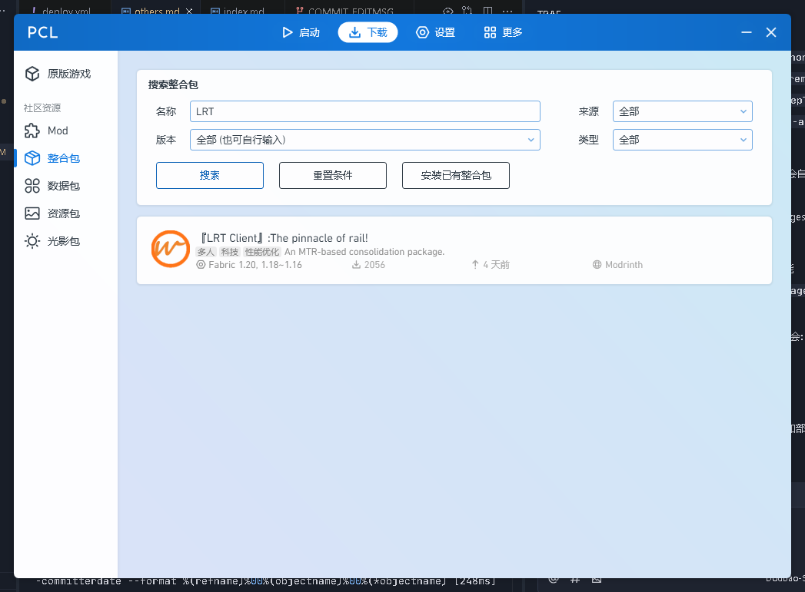

# 服务器资源

## 游戏资源
* **[LRT Serve-only模组](https://github.com/BuelieR/lrt-server-only)**
* **`CTS广州地铁追加包`(请到服务器QQ群内下载，此为服务器获授权资源)**
* **[LRT 客户端整合包](https://modrinth.com/modpack/the-pinnacle-of-rail!/versions)**
> **TIPS: 你可以在PCL/HMCL/BakaXL等启动器中搜索`LRT`以下载服务器特供整合包（如图所示，前提是你需要联网），整合包全称为`『LRT Client』:The pinnacle of rail!`。当然，为了避免不必要的纠纷，你还是需要到QQ群下载付费资源包。我们会定期更新整合包，主要在服务器添加大量新mod的时候进行更新。**

## 服务器链接
* **[高铁站以及普速站站台申请](https://v.wjx.cn/vm/hpRoGPo.aspx)**
* **[OP权限申请](https://v.wjx.cn/vm/PvFvfek.aspx#)**
* **[公司注册网址](https://www.wjx.cn/vm/O1ihyEQ.aspx#)**

# 编辑者
* **BuelieR(离烟)**

---
***[编辑者]: 编辑者名称默认使用Github昵称，若您未绑定Github账号，编辑者名称默认使用QQ昵称，括号内可填写编辑者其他名称***

***[贡献]: 如果您想贡献本项目，欢迎到[`Github仓库`](https://github.com/BuelieR/LRT_RULES)提交PR/Issue，我们会视情况合并。***